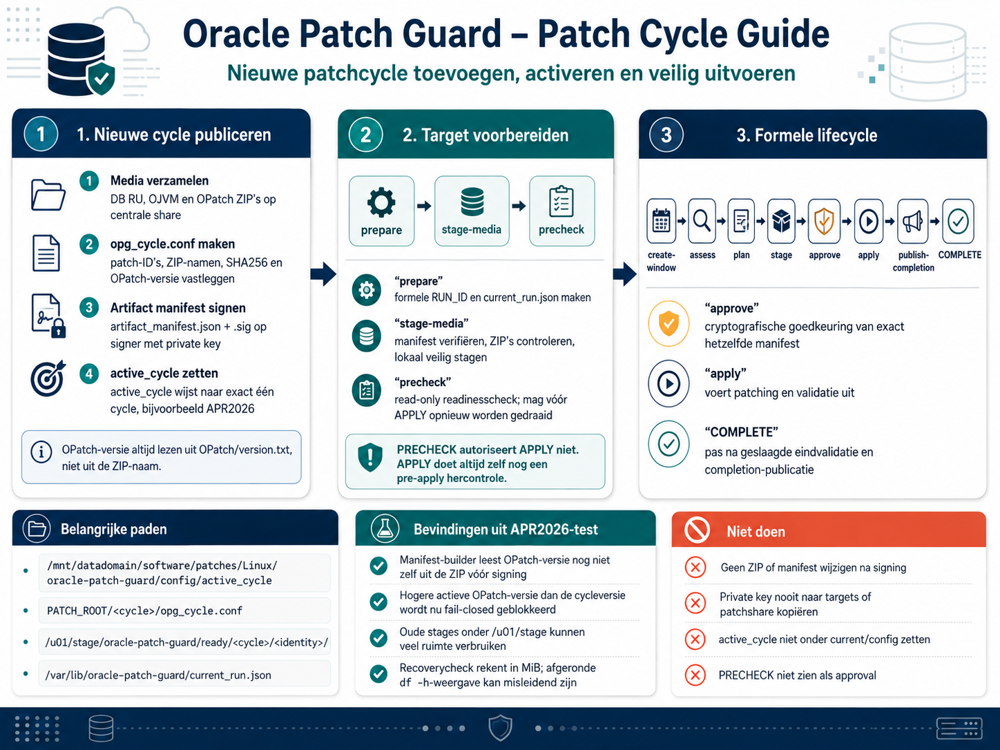

# Nieuwe patchcycle toevoegen en activeren

<p align="center">
  
</p>

Deze handleiding beschrijft de actuele werkwijze voor het voorbereiden,
ondertekenen, activeren en gebruiken van een nieuwe Oracle Patch Guard-cycle.
Het praktijkvoorbeeld is de geteste overgang:

```text
Oracle 19.30 → APR2026 → Oracle 19.31
```

met DB RU `39034528`, OJVM `38906621` en OPatch `12.2.0.1.52`.
Het activeren van een cycle selecteert uitsluitend de metadata en media. Het
autoriseert geen PLAN of APPLY.

## 1. Eenvoudig overzicht

1. **Media verzamelen** — plaats exact de bedoelde DB RU-, OJVM- en
   OPatch-ZIP's op de centrale share en controleer de Oracle-documentatie.
2. **Cycle vastleggen** — beschrijf patch-ID's, ZIP's en de werkelijk gevonden
   OPatch-versie in één `opg_cycle.conf`.
3. **Release ondertekenen** — maak op de signer een artifactmanifest en
   onderteken dat met de afgeschermde private key.
4. **Cycle activeren** — laat `active_cycle` verwijzen naar de nieuwe cycle,
   zodat targets dezelfde gecontroleerde release selecteren.
5. **Target voorbereiden** — maak de formele runcontext, stage de media lokaal
   en voer daarna de eerste read-only PRECHECK uit.
6. **Plan en goedkeuren** — maak het onderhoudsvenster, voer assessment en PLAN
   uit en laat exact dat manifest cryptografisch goedkeuren.
7. **Uitvoeren en bewijzen** — APPLY hercontroleert alles, patcht en valideert;
   completion-publicatie legt het terminale bewijs vast.

## Waarom is PRECHECK bij een nieuwe cycle niet letterlijk de eerste operationele stap?

PRECHECK is functioneel een vroege veiligheidscontrole: hij verandert geen
database, maakt geen formeel patchmanifest en kan APPLY niet autoriseren. In de
huidige stable is `LOCAL_MEDIA_MODE=required`. PRECHECK moet daarom ook kunnen
bewijzen dat de geselecteerde lokale patchmedia bestaan en geldig zijn.

Voor een volledig nieuwe cycle is de praktische voorbereidingsflow dus:

```text
new-run → prepare → stage-media → precheck
```

Een PRECHECK vóór `stage-media` mag en hoort fail-closed te blokkeren met
`MEDIA_STAGE_UNAVAILABLE`. Nadat de media geldig zijn gestaged, kan PRECHECK
herhaald worden, ook als last-minute readiness-check vóór APPLY. PRECHECK
autoriseert APPLY niet en vervangt nooit de verplichte pre-apply-hercontrole
binnen APPLY.

## 2. Praktische DBA-flow

### 2.1 Patchmedia verzamelen en controleren

Maak op de centrale patchshare een directory voor `APR2026`. Plaats daarin de
originele DB RU- en OJVM-transport-ZIP. Plaats de OPatch-ZIP onder de bestaande
`OPATCH_ROOT`; maak geen tweede OPatch-locatie.

Voor dit voorbeeld zijn de gegevens:

| Onderdeel | Waarde |
|---|---|
| Cycle | `APR2026` |
| Bronversie | Oracle Database 19.30 |
| Doelversie | Oracle Database 19.31 |
| DB RU | `39034528` |
| OJVM | `38906621` |
| OPatch ZIP | `p6880880_190000_Linux-x86-64.zip` |
| OPatch-versie | `12.2.0.1.52` |

Controleer vóór publicatie:

- de patch-ID's en vereisten in de bijbehorende Oracle README's;
- dat iedere ZIP een regulier bestand en geen symlink is;
- de exacte bestandsnaam en SHA256 van iedere originele ZIP;
- de verwachte RU/OJVM ZIP-layout;
- dat de OPatch-ZIP uitsluitend de bedoelde `OPatch/`-inhoud bevat.

Bereken bijvoorbeeld de checksums met:

```bash
sha256sum \
  p39034528_190000_Linux-x86-64.zip \
  p38906621_190000_Linux-x86-64.zip \
  /path/to/opatch/p6880880_190000_Linux-x86-64.zip
```

### 2.2 OPatch-versie uit de werkelijke ZIP lezen

Leid de OPatch-versie nooit af uit de ZIP-bestandsnaam. In de APR2026-test is
`12.2.0.1.52` gelezen uit `OPatch/version.txt` in de werkelijk gebruikte ZIP:

```bash
unzip -p /path/to/opatch/p6880880_190000_Linux-x86-64.zip \
  OPatch/version.txt
```

De versie in deze drie bronnen moet exact gelijk zijn:

1. `OPATCH_VERSION` in `opg_cycle.conf`;
2. `artifacts.opatch.version` in `artifact_manifest.json`;
3. de versie in `OPatch/version.txt` van de werkelijk gebruikte ZIP.

Een verschil is geen waarschuwing maar een releasefout die fail-closed moet
blokkeren.

### 2.3 `opg_cycle.conf` maken

Plaats het bestand als `PATCH_ROOT/APR2026/opg_cycle.conf`. Gebruik de exacte
ZIP-bestandsnamen en vervang de SHA256-placeholders door de berekende lowercase
64-hexwaarden:

```ini
PATCH_CYCLE=APR2026
DB_RU_PATCH_ID=39034528
OJVM_PATCH_ID=38906621
OPATCH_VERSION=12.2.0.1.52
OPATCH_ZIP=p6880880_190000_Linux-x86-64.zip
DB_RU_ZIP=p39034528_190000_Linux-x86-64.zip
DB_RU_ZIP_SHA256=<exacte_db_ru_zip_sha256>
OJVM_ZIP=p38906621_190000_Linux-x86-64.zip
OJVM_ZIP_SHA256=<exacte_ojvm_zip_sha256>
OPATCH_ZIP_SHA256=<exacte_opatch_zip_sha256>
ARTIFACT_MANIFEST=artifact_manifest.json
ARTIFACT_MANIFEST_SIG=artifact_manifest.sig
```

De wrapper parseert uitsluitend de toegestane keys en sourcet dit bestand
niet als shellcode. Dubbele, ontbrekende, lege of onbekende keys blokkeren.

### 2.4 Artifactmanifest maken en ondertekenen

Voer de builder uit op de signer, waar de private key afgeschermd beschikbaar
is. Gebruik dezelfde ZIP-bytes als in `opg_cycle.conf`:

```bash
python3 opg_build_artifact_manifest.py \
  --cycle APR2026 \
  --db-patch-id 39034528 \
  --db-zip /path/to/APR2026/p39034528_190000_Linux-x86-64.zip \
  --ojvm-patch-id 38906621 \
  --ojvm-zip /path/to/APR2026/p38906621_190000_Linux-x86-64.zip \
  --opatch-version 12.2.0.1.52 \
  --opatch-zip /path/to/opatch/p6880880_190000_Linux-x86-64.zip \
  --private-key /secure/path/artifact-signing-private.pem \
  --output-dir /path/to/APR2026
```

De output bestaat uit:

- `artifact_manifest.json`;
- `artifact_manifest.sig`.

De private key wordt nooit naar targets of de centrale patchshare gekopieerd.
Controleer na generatie opnieuw cycle, patch-ID's, bestandsnamen, SHA256's en
OPatch-versie in het manifest.

### 2.5 `active_cycle` activeren

De operationele active-cyclepointer staat op:

```text
/mnt/datadomain/software/patches/Linux/oracle-patch-guard/config/active_cycle
```

Hij staat nadrukkelijk niet onder `current/config/`. De code gebruikt
`${OPG_ROOT}/config/active_cycle`; `current` wijst uitsluitend naar de actieve
immutable softwarerelease.

Plaats atomisch exact één regel in `active_cycle`:

```text
APR2026
```

Behoud de beveiligde owner/mode van de operationele configuratie. De pointer,
de cycledirectory en `PATCH_CYCLE=APR2026` moeten exact overeenkomen.

### 2.6 Target voorbereiden en media stagen

Voer voor een volledig nieuwe cycle uit:

```bash
opg_oem.sh new-run
opg_oem.sh prepare
opg_oem.sh stage-media
opg_oem.sh precheck
```

`new-run` ontdekt de actieve SID en exacte Oracle Home. Als nog geen context
bestaat, maakt deze stap de formele RUN_ID/context in
`/var/lib/oracle-patch-guard/current_run.json`. Een exact passende context
wordt ongewijzigd hergebruikt. Alleen een terminale context van een andere
cycle wordt veilig gearchiveerd en vervangen. Zonder expliciete
`OPG_NEW_RUN_REASON` gebruikt OPG bijvoorbeeld:

```text
Automatic OEM run rotation: APR2026 -> JUL2026
```

`prepare` voert vervolgens de hostvoorbereiding uit en hergebruikt exact die
formele context.

`stage-media`:

1. leest `active_cycle` en `opg_cycle.conf`;
2. verifieert `artifact_manifest.sig` met de lokale trusted public key;
3. vergelijkt cycle, patch-ID's, ZIP-namen, groottes, SHA256's en OPatch-versie;
4. valideert de ZIP-layout en `OPatch/version.txt`;
5. kopieert en hasht de transport-ZIP's;
6. pakt DB RU en OJVM gecontroleerd uit;
7. berekent de deterministische V2 tree hashes;
8. publiceert de stage atomisch onder:

```text
/u01/stage/oracle-patch-guard/ready/<cycle>/<identity>/
```

`<identity>` is de SHA256 van exact het ondertekende artifactmanifest. Een
bestaande identieke stage mag na volledige herverificatie worden hergebruikt;
een conflicterende, gemuteerde of incomplete stage wordt geweigerd.

### 2.7 Formele lifecycle

Na een bruikbare PRECHECK volgt de formele lifecycle:

```text
create-window → assess → plan → stage → approve → approval-check → apply
```

Via de OEM-wrapper:

```bash
opg_oem.sh create-window
opg_oem.sh assess
opg_oem.sh plan
opg_oem.sh stage
```

Op de signer:

```bash
opg_approve_run.sh <RUN_ID>
```

Op het target, binnen het goedgekeurde onderhoudsvenster:

```bash
# Verifieer de gepubliceerde approval vóór de geplande uitvoering
opg_oem.sh approval-check

# Optioneel opnieuw: read-only last-minute readinesscheck
opg_oem.sh precheck

# Formele uitvoering voor de ongewijzigde approved RUN_ID
opg_oem.sh apply
```

APPLY voert zelf altijd de verplichte pre-apply-hercontrole uit voordat een
database of listener wordt gestopt.

### 2.8 APR2026-resultaat herkennen

De volledige voorbeeldketen is:

```text
cycle maken
→ manifest signen
→ active_cycle=APR2026
→ new-run
→ prepare
→ stage-media
→ precheck
→ create-window
→ assess
→ plan
→ stage
→ approve
→ approval-check
→ apply
→ validate
→ automatische completion-publicatie
→ automatische lokale stage-cleanup
→ COMPLETE
```

`validate` is onderdeel van APPLY en controleert onder meer OPatch inventory,
DB RU en OJVM per vereiste container, registry/componentstatus, invalid objects,
PDB-state, database, listener en services. COMPLETE is pas betrouwbaar wanneer
de technische eindvalidatie en de hashgebonden completion-publicatie voor
dezelfde RUN_ID zijn geslaagd. `publish-completion` blijft beschikbaar als
handmatige recovery/republication-actie wanneer alleen de publicatie na
`12_COMPLETE` is mislukt.

### 2.9 Eigenschappen per stap

| Stap | Verandert database? | Formele run | Approval vereist | Doel |
|---|---:|---|---:|---|
| Cycle maken/signen/activeren | Nee | Nee | Nee | Exacte patchrelease en vertrouwde artifactidentiteit publiceren. |
| `new-run` | Nee | Maakt of selecteert de formele RUN_ID/context | Nee | Een nieuwe cycle veilig starten zonder een niet-terminale context te overschrijven. |
| `prepare` | Nee | Gebruikt de formele RUN_ID/context | Nee | De host voorbereiden en de eerder geselecteerde targetcontext hergebruiken. |
| `stage-media` | Nee | Gebruikt formele context | Nee | Ondertekende media veilig lokaal valideren en publiceren. |
| `precheck` | Nee | Eigen niet-formele PRECHECK-RUN_ID | Nee | Read-only readiness meten zonder APPLY te autoriseren. |
| `create-window` | Nee | Gebruikt formele run | Nee | Het maintenance-window aan exact target en run binden. |
| `assess` | Nee | Gebruikt formele run | Nee | Readiness en recoveryvoorwaarden formeel vastleggen. |
| `plan` | Nee | Gebruikt formele run | Nee | Immutable runmanifest en PLAN genereren. |
| `stage` | Nee | Gebruikt formele run | Nee | De vaste PLAN-artifacts voor de signer publiceren. |
| `approve` | Nee | Gebruikt formele run | Is de approval | Exact hetzelfde manifest cryptografisch autoriseren. |
| `apply` | Ja, pas na pre-apply | Gebruikt formele approved run | Ja | OPatch/RU/OJVM/datapatch gecontroleerd uitvoeren. |
| `validate` binnen APPLY | Nee, controleert resultaat | Gebruikt formele approved run | Ja, als onderdeel van APPLY | Database-, PDB-, SQLPATCH-, listener- en servicestatus bewijzen. |
| `publish-completion` | Nee | Gebruikt terminale formele run | Gebruikt bestaande approval | Hashgebonden COMPLETE-evidence centraal publiceren. |

## 3. Technische verdieping

### `active_cycle`

`active_cycle` selecteert één centrale cycledirectory. De pointer is geen
approval en bevat geen RUN_ID. Wrapper en mediahelper eisen een veilige file,
geldige cyclenaam en exacte overeenkomst met `PATCH_CYCLE`.

### `current_run.json`

`new-run` maakt of selecteert de formele hostcontext met RUN_ID, host, SID,
Oracle Home en cyclemetadata. `prepare` en alle vervolgfases moeten exact
dezelfde context hergebruiken.
PRECHECK gebruikt een afzonderlijke tijdelijke RUN_ID en wijzigt
`current_run.json` niet.

### Manifest en signing

Het artifactmanifest beschrijft de centrale transportartifacts; de detached
signature bewijst dat de signer exact die manifestbytes heeft ondertekend.
PLAN maakt later een afzonderlijk runmanifest dat target, Oracle Home, lokale
stage en recovery-evidence bindt. Artifact-signing en run-approval zijn dus
twee verschillende vertrouwensstappen.

### SHA256 en V2 tree hashes

De ZIP-SHA256 bindt de originele transportbytes. Na veilige extractie bindt de
V2 tree hash de volledige lokale RU/OJVM execution tree. PLAN legt deze lokale
identiteit vast; APPLY en resume herberekenen de relevante hashes vóór gebruik.

### Stage identity

De stage identity is de SHA256 van `artifact_manifest.json`. Daardoor kunnen
meerdere immutable identities van één cycle naast elkaar bestaan zonder dat
een bestaande stage wordt overschreven. `active_stage` verwijst uitsluitend
naar een volledig gevalideerde gepubliceerde identity.

### Recovery- en capacitychecks

OPG controleert databasebackup, Oracle Home-herstelbaarheid en beschikbare
ruimte afzonderlijk. De Oracle Home-recoverycheck gebruikt `df -Pm` en rekent
in hele MiB; een afgeronde weergave van `df -h` is niet beslissend.

## Bevindingen / verbeterpunten uit APR2026-test

Deze punten beschrijven huidig gedrag en kandidaten voor een latere aparte
codewijziging. Ze worden door deze documentatiewijziging niet geïmplementeerd.

### Manifest-builder en OPatch-versie

`opg_build_artifact_manifest.py` vertrouwt momenteel de handmatig opgegeven
`--opatch-version` en leest `OPatch/version.txt` niet zelfstandig. Daardoor kan
een cryptografisch geldig maar inhoudelijk fout artifactmanifest worden
gesigneerd. De targetstager leest `OPatch/version.txt` later wel en blokkeert
een mismatch fail-closed. Een toekomstige cycletool of manifest-builder moet
de versie vóór signing zelf uit de ZIP lezen en iedere mismatch weigeren.

### Actieve OPatch-versie hoger dan cycleversie

De huidige runtime blokkeert wanneer de actieve OPatch-versie hoger is dan de
in de cycle vereiste versie; automatische downgrade is verboden. Dit is het
huidige veiligheidsbeleid. Of een aantoonbaar compatibele hogere versie later
zonder downgrade mag worden geaccepteerd, is een open ontwerpbeslissing en in
deze handleiding nadrukkelijk geen gewenste nieuwe policy.

### Retentie van oude stages

In de APR2026-test bleef een oude JUL2026-stage van circa 5,7 GB staan. Dat was
de aanleiding voor automatische, referentiebewuste cleanup: na bewezen
`12_COMPLETE` en succesvolle completion-publicatie verwijdert OPG uitsluitend
de aan die run gebonden lokale execution-stage. Bij twijfel of een andere run
dezelfde identity nog nodig heeft, blijft de stage fail-closed behouden. Zie
[Lokale stage-cleanup](STAGE_CLEANUP.md); handmatige blinde verwijdering blijft
geen veilige oplossing.

### MiB versus afgeronde `df -h`-weergave

De recoverycheck blokkeerde in de APR2026-test terecht bij:

```text
16020 MiB < 16384 MiB
```

`df -h` rondde dezelfde vrije ruimte visueel af naar `16G`. OPG gebruikt de
niet-afgeronde MiB-waarde uit `df -Pm`; daardoor was de vereiste 16384 MiB niet
bereikt en was `HOME_RECOVERY_NOT_VERIFIED` correct.

## Niet doen

- wijzig geen ZIP, cycleconfig of manifest nadat het manifest is ondertekend;
- plaats de private key niet op targets of de patchshare;
- zet `active_cycle` niet onder `current/config/`;
- behandel PRECHECK niet als approval of vervanging van pre-apply;
- verwijder geen oude stage zolang niet bewezen is dat geen run ernaar verwijst;
- forceer `MEDIA_STAGE_UNAVAILABLE`, recovery- of capacityfindings niet naar
  succes.
