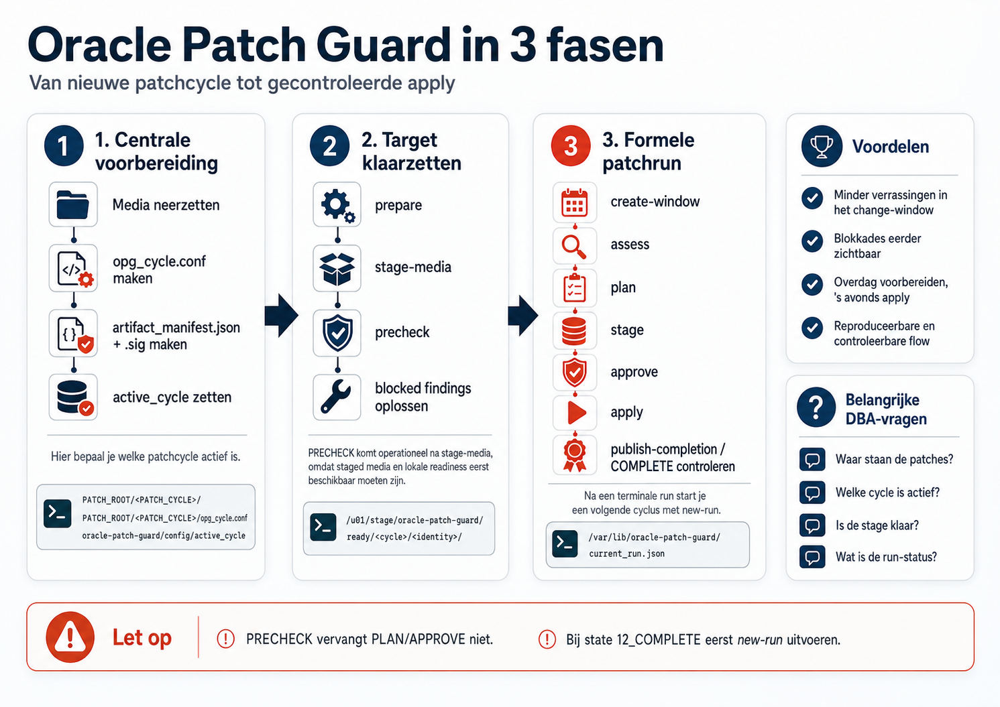

# Oracle Patch Guard — Quick Start

<p align="center">
  
</p>

Deze quick start beschrijft de huidige baseline
`oracle-patch-guard-stable-20260902`. Het is geen vervanging voor lokale
change-, backup-, recovery- en securityprocedures.

## 1. Wat is OPG?

Oracle Patch Guard (OPG) beheert een nieuwe patchcycle in twee opeenvolgende
delen. Eerst worden targetcontext en lokale media voorbereid:

```text
prepare → stage-media → precheck
```

Daarna volgt de formele lifecycle:

```text
create-window → assess → plan → stage → approve → apply → publish-completion
```

PRECHECK is een herhaalbare, read-only readinesscontrole. Bij
`LOCAL_MEDIA_MODE=required` moeten de gevalideerde lokale media eerst bestaan;
PRECHECK vóór staging mag daarom blokkeren met `MEDIA_STAGE_UNAVAILABLE`.
PRECHECK maakt geen formeel manifest, wijzigt geen actieve runcontext en kan
APPLY nooit autoriseren. Hij kan later opnieuw worden uitgevoerd als
last-minute readiness-check vóór APPLY, maar vervangt de pre-apply-hercontrole
binnen APPLY niet. PLAN voert de actuele checks altijd opnieuw uit en legt
daarna pas de formele patchintentie vast.

PLAN legt assessment, target, Oracle Home en staged media vast in een immutable
manifest. APPROVE bindt een cryptografische goedkeuring aan exact dat manifest.
APPLY verifieert de approval en veranderlijke pre-apply-condities opnieuw
voordat downtime of patchmutaties worden toegestaan. OPG werkt fail-closed en
publiceert na een volledig geslaagde run afzonderlijke completion evidence.

## 2. Voorwaarden

Voor de huidige stable scope zijn minimaal nodig:

- een ondersteunde single-instance Oracle Database 19c-omgeving;
- de exacte Oracle Home en bijbehorende actieve SID;
- gevalideerde RU-, OJVM- en OPatch-media plus geldige cycleconfiguratie;
- beschikbare signer- en approval-infrastructuur;
- geslaagde databasebackup- en Oracle Home-recoverycontroles;
- voldoende vrije diskruimte volgens de beveiligde siteconfiguratie;
- een ondersteunde OEM/OPG-wrapper of ondersteund entrypoint.

RAC, SEHA, ASM/Grid en Data Guard vallen niet binnen de huidige automatische
APPLY-scope. `BLOCKED` of `UNKNOWN` mag niet operationeel worden omgezet in
toestemming om te patchen.

## 3. Fresh host

De normale fresh-host flow voert eerst de gecontroleerde bootstrap uit. Deze
installeert en valideert:

- de lokale root-helpers;
- het begrensde sudoers-fragment;
- de beveiligde runtimeconfiguratie;
- de stage anchors vanaf `/u01/stage`.

Voer bij de normale flow geen handmatige `cp`, `chmod` of configinstallatie op
het target uit. Een bootstrapfout moet eerst worden opgelost; ga niet verder
met PLAN op een gedeeltelijk ingericht target.

## 4. Een nieuwe patchcycle voorbereiden

Voor het concrete APR2026-voorbeeld gelden:

```text
Oracle 19.30 → APR2026 → Oracle 19.31
DB RU: 39034528
OJVM: 38906621
OPatch: 12.2.0.1.52
```

De OPatch-versie is gelezen uit `OPatch/version.txt` van de werkelijk gebruikte
ZIP. Deze versie moet exact gelijk zijn in `opg_cycle.conf`,
`artifact_manifest.json` en de ZIP zelf.

Maak en onderteken eerst de centrale cycle-artifacts en zet daarna de
operationele pointer op `APR2026`:

```text
/mnt/datadomain/software/patches/Linux/oracle-patch-guard/config/active_cycle
```

Gebruik niet `current/config/active_cycle`. Start vervolgens op het target:

```text
prepare → stage-media → precheck
```

`prepare` maakt de formele RUN_ID/context. `stage-media` verifieert signature,
ZIP SHA256, OPatch-versie en lokale V2 tree hashes en publiceert de immutable
stage onder `/u01/stage/oracle-patch-guard/ready/<cycle>/<identity>/`.

Zie [PATCH_CYCLE_GUIDE.md](PATCH_CYCLE_GUIDE.md) voor de volledige
stap-voor-stapprocedure, het signercommando, de technische bindings en de
APR2026-bevindingen.

## 5. Formele run voorbereiden

Start PLAN via de ondersteunde OEM/OPG-flow. Conceptueel doorloopt een nieuwe
run de volgende voorbereidende fasen:

```text
create-window → assess → plan → stage
```

Een succesvolle voorbereiding eindigt in `WAITING_FOR_APPROVAL`. Leg minimaal
de volgende gegevens vast voor review en signing:

- `RUN_ID`;
- assessment en findings;
- SHA256 van het immutable manifest;
- de approval destination voor exact dezelfde RUN_ID.

De assessmentstatus betekent:

- `READY`: voorbereiding mag doorgaan;
- `CONDITIONAL`: alleen doorgaan na expliciete acceptatie van iedere finding;
- `BLOCKED`: niet patchen;
- `UNKNOWN`: controle kon niet betrouwbaar worden uitgevoerd; niet patchen.

## 6. APPROVE

Voer signing uit op de daarvoor ingerichte signerhost. Voor één run:

```bash
opg_approve_run.sh <RUN_ID>
```

Voor meerdere pending runs kan eerst de selectie worden bekeken en daarna de
batch worden gestart:

```bash
opg_approve_pending.sh --all --dry-run
opg_approve_pending.sh --all
```

De batch vraagt één expliciete bevestiging. Iedere geselecteerde RUN_ID wordt
daarna afzonderlijk door de bestaande single-run signer verwerkt. Ga alleen
verder wanneer manifest signature en approval signature als VERIFIED zijn
beoordeeld en de runstatus `APPROVED` is.

## 7. APPLY

Start APPLY uitsluitend via de ondersteunde flow voor dezelfde RUN_ID. OPG:

1. verifieert approval, signatures en manifestbinding opnieuw;
2. verkrijgt de Oracle Home-lock en herhaalt de veranderlijke pre-apply-checks;
3. stopt databases en listeners gecontroleerd, maar pas nadat de hercontrole
   patchen toestaat;
4. voert waar nodig de gecontroleerde OPatch-upgrade en daarna DB RU en OJVM
   uit;
5. start database en listener vanuit de juiste Oracle Home;
6. bereidt user-PDB's voor, voert datapatch uit en valideert RU/OJVM per
   container;
7. herstelt en controleert de oorspronkelijke PDB-state;
8. voert `utlrp` en de eindvalidatie uit;
9. publiceert completion evidence.

Onderbreek APPLY niet handmatig, tenzij OPG dat expliciet vereist of een
operationele noodsituatie ingrijpen noodzakelijk maakt. Start na een storing
niet blind een nieuwe APPLY of nieuwe RUN_ID.

## 8. CDB/PDB-gedrag

- OPG valideert `CDB$ROOT` plus alle verwachte user-PDB's uit de oorspronkelijke
  PDB-state.
- `PDB$SEED` valt buiten de OPG user-PDB-validatieset.
- READ ONLY of MOUNTED user-PDB's kunnen voor datapatch tijdelijk READ WRITE
  worden geopend.
- Na succesvolle datapatch-validatie wordt de oorspronkelijke PDB-state
  hersteld en met een verse SQL-query gecontroleerd.
- Voor iedere verwachte container moeten zowel RU als OJVM exact één geldig
  laatste record met status SUCCESS hebben.
- Missing, duplicate, ambiguous, unexpected, unparseable of non-SUCCESS
  evidence stopt fail-closed.
- Een open- of restorefout kan leiden tot `PARTIAL` of
  `MANUAL_INTERVENTION_REQUIRED`. OPG voert geen automatische rollback uit.

## 9. Succes herkennen

De belangrijke terminale resultaatregels hebben deze vorm:

```text
OPG_RESULT|...|status=COMPLETE|phase=VALIDATION|exit_code=0
OPG_COMPLETION_PUBLISH|...|status=SUCCESS
```

Behandel de centrale status pas als betrouwbaar COMPLETE wanneer de
eindvalidatie is geslaagd en de hash-bound `completion.json` succesvol voor
dezelfde RUN_ID is gepubliceerd.

## 10. Als iets stopt

| Status | Betekenis | Actie |
|---|---|---|
| `WAITING_FOR_APPROVAL` | PLAN is gereed voor review | Laat exact het gebonden manifest beoordelen en signen. |
| `BLOCKED` | Een controle bewijst dat patchen niet mag | Niet patchen; los de oorzaak op en volg de ondersteunde nieuwe beoordeling. |
| `UNKNOWN` | Veiligheid kon niet betrouwbaar worden vastgesteld | Niet patchen; onderzoek ontbrekende of inconsistente evidence. |
| `PARTIAL` | De muterende flow is niet volledig afgerond | Bewaar state en logs; laat een bevoegde DBA de gedocumenteerde resume/recoveryroute beoordelen. |
| `MANUAL_INTERVENTION_REQUIRED` | Automatisch veilig vervolg is niet bewezen | Geen blinde retry; voer inhoudelijke state-, inventory- en recoveryanalyse uit. |
| `COMPLETE` | Eindvalidatie en completion-publicatie zijn bewezen | Bewaar run- en approval-evidence volgens het lokale auditbeleid. |

Gebruik voor diagnose de runlogs, `execution_state.json`, assessment- en
validatie-evidence. Een nieuwe RUN_ID is geen herstelmethode voor een actieve of
gedeeltelijke run.

## 11. Belangrijke locaties

De exacte roots komen uit de beveiligde runtimeconfiguratie. Conceptueel zijn
de belangrijkste locaties:

- runtimeconfiguratie: `/etc/oracle-patch-guard/patchGD_guard.conf`;
- runlogs en lokale state: `RUN_ROOT/<RUN_ID>`;
- actieve runcontext: `/var/lib/oracle-patch-guard/current_run.json`;
- approvals en completion evidence: `APPROVAL_ROOT/<RUN_ID>`;
- lokale staged media: `/u01/stage/oracle-patch-guard/ready/...`.

`/u01/stage` is de OPG stage trust boundary. `/u01` zelf valt buiten deze
stage-policy.

## 12. Wat niet doen

- Plaats geen ad-hocwijzigingen in `current`; gebruik een gevalideerde immutable
  release-directory.
- Voer geen handmatige patchmutaties uit tijdens een actieve OPG-run.
- Wijzig geen manifest-, approval-, signature- of completion-artifacts.
- Verwijder geen `.patch_storage`, OPatch-backup of run-evidence.
- Gebruik oude Pilot07-migratiedocumentatie niet als huidig deploymentrunbook.
- Forceer `BLOCKED`, `UNKNOWN`, `PARTIAL` of
  `MANUAL_INTERVENTION_REQUIRED` nooit naar succes.

## 13. Verdere documentatie

- [README.md](README.md) — actuele stable introductie en scope;
- [PATCH_CYCLE_GUIDE.md](PATCH_CYCLE_GUIDE.md) — nieuwe patchcycle maken,
  ondertekenen, activeren en stagen;
- [RELEASE_NOTES_20260831.md](RELEASE_NOTES_20260831.md) — stable wijzigingen
  en live validatie;
- [TREE_HASH_V2_SPEC.md](TREE_HASH_V2_SPEC.md) — normatieve tree-hashdefinitie;
- [COMPLETION_PUBLICATION_VALIDATION_REPORT.md](COMPLETION_PUBLICATION_VALIDATION_REPORT.md)
  — completion-publicatie en signerclassificatie;
- `PILOT07_*.md` — uitsluitend historische ontwerp- en pilotevidence; controleer
  altijd de banner bovenaan voordat u deze documenten gebruikt.
