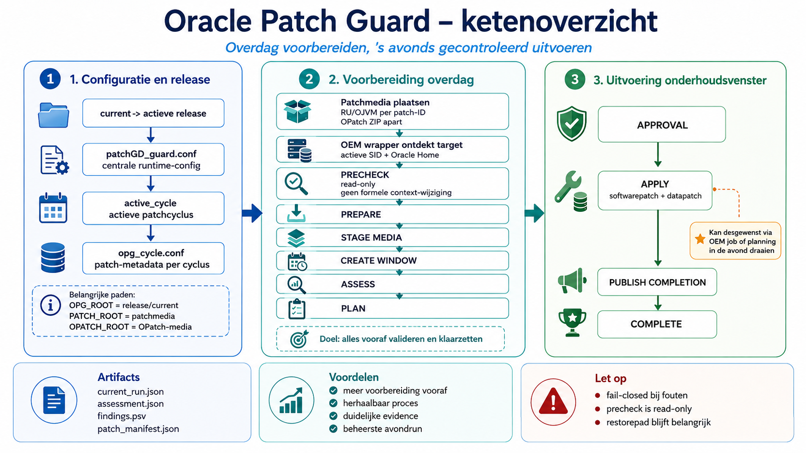

# Oracle Patch Guard

Oracle Patch Guard (OPG) is een veilig, controleerbaar en door goedkeuring
gestuurd framework voor het patchen van Oracle Database, met validatie van
staged media, cryptografische goedkeuring en multi-target-ondersteuning.

<p align="center">
  
</p>

## Ketenoverzicht

Onderstaand overzicht laat zien hoe Oracle Patch Guard een nieuwe patchrelease
van voorbereiding tot gecontroleerde uitvoering en bewijsvoering verwerkt.



De gecontroleerde workflow is:

```text
PRECHECK → PLAN → APPROVE → APPLY
```

PRECHECK voert dezelfde readinesschecks read-only en herhaalbaar uit, zonder
formeel manifest, approval staging of wijziging van de actieve runcontext. Een
latere PLAN voert deze checks altijd opnieuw uit.

PLAN legt een fail-closed preflight-assessment vast en bindt het exacte target,
de Oracle Home, patchmedia en recovery-evidence in een immutable manifest.
APPROVE ondertekent dat manifest en een afzonderlijk approval-token. APPLY
verkrijgt de Oracle Home-lock, herhaalt veranderlijke controles, verifieert de
lokale staged media en cryptografische bindingen opnieuw en staat pas daarna
downtime of patchmutaties toe.

## Belangrijkste eigenschappen

- preflight-assessment ruim vóór het onderhoudsvenster;
- een verse pre-apply-hercontrole voordat de database of listener wordt
  gestopt;
- lokale, gevalideerde media staging met ZIP SHA256 en deterministische V2
  tree hashes;
- cryptografische manifest-binding en expliciete goedkeuring;
- herverificatie bij APPLY en resume met fail-closed state-afhandeling;
- validatie van Oracle Home, PMON, listener, SID, service en SQL-patches;
- gecontroleerde OPatch self-upgrade vóór RU/OJVM-mutaties;
- multi-target-ondersteuning met een lock per host en Oracle Home;
- OEM-integratie via begrensde wrappers en lokale privileged helpers;
- statusrapportage aan signer-zijde en orchestratie van batchgoedkeuringen.

## Stable baseline 2026-08-31

De stable baseline voegt de live gevalideerde lifecycle toe rond het bestaande
PLAN → APPROVE → APPLY-contract:

- exacte datapatch-validatie per container voor `CDB$ROOT` en iedere verwachte
  user-PDB; een ontbrekend, dubbel, ambigu of niet-SUCCESS RU/OJVM-record leidt
  fail-closed tot stoppen;
- user-PDB's die READ ONLY of MOUNTED waren, worden voor datapatch tijdelijk
  READ WRITE geopend en na succesvolle validatie in hun oorspronkelijke state
  hersteld; `PDB$SEED` is uitgesloten van de user-PDB-validatieset;
- fresh-host bootstrap installeert de begrensde root-helpers, het gevalideerde
  sudoers-fragment, de beveiligde runtimeconfiguratie en de anchors onder
  `/u01/stage`;
- runtime- en approval-roots worden uit beveiligde configuratie bepaald in
  plaats van via fallbacks naar runtime-sharepaden;
- batchgoedkeuring vraagt eenmaal om bevestiging en delegeert daarna iedere
  geselecteerde run aan de enige single-run signing-implementatie;
- een succesvolle APPLY publiceert met hashes gebonden
  `completion.json`-evidence, waardoor een historisch geldige COMPLETE na het
  verlopen van de approval COMPLETE kan blijven.

De baseline is in non-productie gevalideerd op Oracle Database 19.32 met een
CDB en user-PDB, DB RU 39472050 en OJVM RU 39222882. De volledige live flow is
succesvol afgerond, inclusief completion-publicatie. Zie
[`RELEASE_NOTES_20260831.md`](RELEASE_NOTES_20260831.md).

## Repository-indeling

- `project/` — Patch Guard-core, controles, OEM-wrappers, fixtures en tests;
- `oem-tasks/` — target-orchestratie, approval staging en mediahelpers;
- `signer/` — read-only runstatus en orchestratie van multi-target-goedkeuring;
- `config/examples/` — generieke voorbeelden voor cycles en sudoers;
- `tools/` — standalone benchmark voor hashing;
- `PILOT07_*.md`, `TREE_HASH_V2_SPEC.md` — documentatie over ontwerp, security
  en validatie.

Site-specifieke waarden horen thuis in een beveiligde lokale configuratie die
is gekopieerd van `project/patchGD_guard.conf.example`. De repository bevat
bewust geen productieconfiguratie, private key, approval-data of
release-archief.

Publieke voorbeeldpaden gebruiken `/mnt/patch-share`; voorbeeldhosts gebruiken
het gereserveerde domein `example.com`. Controleer vóór deployment ieder pad,
iedere owner en group, iedere sudo-regel, recovery-hook en het beleid voor het
onderhoudsvenster.

## Validatie

Voer dit uit op Linux, waarbij Bash, Python 3, OpenSSL en ShellCheck beschikbaar
zijn:

```bash
cd project
bash tests/run_tests.sh
bash tests/run_open_checks_tests.sh
bash tests/run_pilot05b_tests.sh
bash tests/run_oem14_approval_tests.sh
bash tests/run_oem_wrapper_tests.sh
bash tests/run_pilot07_tests.sh
bash tests/run_signer_pending_tests.sh
bash tests/run_signer_batch_tests.sh
bash tests/run_completion_publication_tests.sh
# Requires root because real uid/gid/mode ownership is asserted:
sudo bash tests/run_bootstrap_tests.sh
```

De huidige stable baseline heeft 351/351 geslaagde regressietests. De
oorspronkelijke evidence van de publieke Pilot07-release blijft beschikbaar in
`PILOT07_VALIDATION_REPORT.md` en `PUBLIC_RELEASE_AUDIT.md`; de validatie van
completion-publicatie is gedocumenteerd in
`COMPLETION_PUBLICATION_VALIDATION_REPORT.md` en de validatie van
configgedreven deploymentpaden in `DEPLOYMENT_PATH_VALIDATION_REPORT.md`.

## Releasediscipline

De gedeployde `current`-link moet verwijzen naar een immutable, gevalideerde
release-directory. Plaats geen ad-hocfixes in `current`. Bereid toekomstige
wijzigingen voor en test ze in een afzonderlijke RC/release-directory, leg de
evidence vast en verplaats `current` pas daarna naar die immutable release.

## Belangrijke beperkingen

- Het project is pilotsoftware en vereist validatie in non-productie voor de
  beoogde Oracle-release, topologie en backupimplementatie.
- RAC-, SEHA-, ASM/Grid- en Data Guard-configuraties worden gedetecteerd en door
  de huidige single-instance-scope geblokkeerd.
- De bestaande site-controlled `opg_approve_run.sh` blijft de enige muterende
  single-run signer. Dit is een integratieafhankelijkheid en het script is niet
  opgenomen in deze repository.

## Licentie

Oracle Patch Guard wordt beschikbaar gesteld onder de
[Apache License 2.0](LICENSE).
