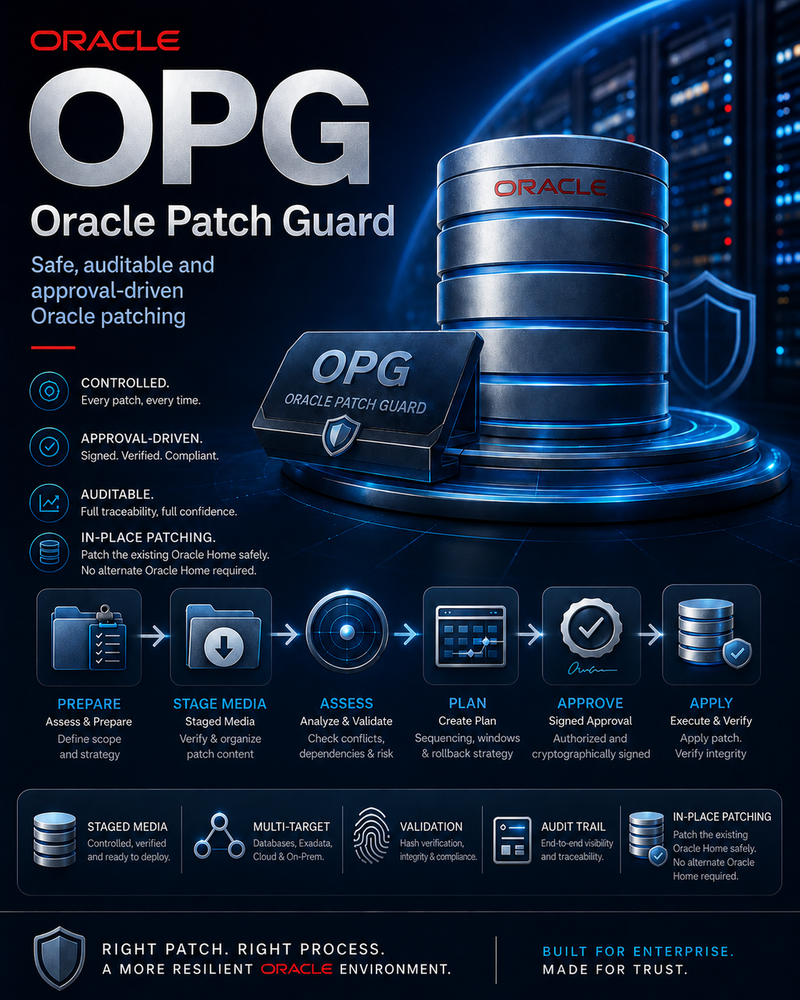

# Oracle Patch Guard

Oracle Patch Guard (OPG) is a safe, auditable and approval-driven Oracle
Database patching framework with staged media validation, cryptographic
approval and multi-target support.

<p align="center">
  
</p>

The controlled workflow is:

```text
PLAN → APPROVE → APPLY
```

PLAN records a fail-closed preflight assessment and binds the exact target,
Oracle Home, patch media and recovery evidence into an immutable manifest.
APPROVE signs that manifest and a separate approval token. APPLY obtains the
Oracle Home lock, repeats volatile checks, re-verifies local staged media and
cryptographic bindings, and only then permits downtime or patch mutation.

## Key properties

- preflight assessment well before the maintenance window;
- a fresh pre-apply recheck before database or listener shutdown;
- local validated media staging with ZIP SHA256 and deterministic V2 tree
  hashes;
- cryptographic manifest binding and explicit approval;
- APPLY and resume re-verification with fail-closed state handling;
- Oracle Home, PMON, listener, SID, service and SQL patch validation;
- controlled OPatch self-upgrade before RU/OJVM mutation;
- multi-target support with a per-host/per-home lock;
- OEM integration through constrained wrappers and local privileged helpers;
- signer-side status reporting and batch approval orchestration.

## Stable 2026-08-31 baseline

The stable baseline adds the live-validated lifecycle around the existing
PLAN → APPROVE → APPLY contract:

- exact per-container datapatch validation for `CDB$ROOT` and every expected
  user PDB; a missing, duplicate, ambiguous or non-SUCCESS RU/OJVM record is
  fail-closed;
- user PDBs that were READ ONLY or MOUNTED are temporarily opened READ WRITE
  for datapatch and are restored to their original state after successful
  validation; `PDB$SEED` is excluded from the user-PDB validation set;
- fresh-host bootstrap installs the constrained root helpers, validated
  sudoers fragment, protected runtime configuration and `/u01/stage` anchors;
- runtime and approval roots are resolved from protected configuration rather
  than runtime share-path fallbacks;
- batch approval asks once and then delegates every selected run to the sole
  single-run signing implementation;
- successful APPLY publishes hash-bound `completion.json` evidence, allowing a
  historically valid COMPLETE to remain COMPLETE after approval expiry.

The baseline was validated in non-production on Oracle Database 19.32 with a
CDB and user PDB, DB RU 39472050 and OJVM RU 39222882. The complete live flow
finished successfully, including completion publication. See
[`RELEASE_NOTES_20260831.md`](RELEASE_NOTES_20260831.md).

## Repository layout

- `project/` — patch guard core, checks, OEM wrappers, fixtures and tests;
- `oem-tasks/` — target orchestration, approval staging and media helpers;
- `signer/` — read-only run status and multi-target approval orchestration;
- `config/examples/` — generic cycle and sudoers examples;
- `tools/` — standalone hashing benchmark;
- `PILOT07_*.md`, `TREE_HASH_V2_SPEC.md` — design, security and validation
  documentation.

Site-specific values belong in a protected local configuration copied from
`project/patchGD_guard.conf.example`. The repository intentionally contains no
production configuration, private key, approval data or release archive.

Example public paths use `/mnt/patch-share`; example hosts use the reserved
`example.com` domain. Review every path, owner, group, sudo rule, recovery hook
and maintenance-window policy before deployment.

## Validation

Run on Linux with Bash, Python 3, OpenSSL and ShellCheck available:

```bash
cd project
bash tests/run_tests.sh
bash tests/run_open_checks_tests.sh
bash tests/run_pilot05b_tests.sh
bash tests/run_oem14_approval_tests.sh
bash tests/run_oem_wrapper_tests.sh
bash tests/run_pilot07_tests.sh
bash tests/run_signer_pending_tests.sh
bash tests/run_signer_batch_tests.sh
bash tests/run_completion_publication_tests.sh
# Requires root because real uid/gid/mode ownership is asserted:
sudo bash tests/run_bootstrap_tests.sh
```

The current stable baseline is 351/351 passing regressions. The original Pilot07
public-release evidence remains in `PILOT07_VALIDATION_REPORT.md` and
`PUBLIC_RELEASE_AUDIT.md`; completion-publication validation is documented in
`COMPLETION_PUBLICATION_VALIDATION_REPORT.md` and config-driven deployment-path
validation in `DEPLOYMENT_PATH_VALIDATION_REPORT.md`.

## Release discipline

The deployed `current` link must reference an immutable, validated release
directory. Do not place ad-hoc fixes in `current`. Prepare and test future
changes in a separate RC/release directory, record its evidence, and only then
move `current` to that immutable release.

## Important limitations

- The project is pilot software and requires non-production validation for the
  target Oracle release, topology and backup implementation.
- RAC, SEHA, ASM/Grid and Data Guard configurations are detected and blocked by
  the current single-instance scope.
- The existing site-controlled `opg_approve_run.sh` remains the sole mutating
  single-run signer. It is an integration dependency and is not included in
  this repository.

## License

Oracle Patch Guard is licensed under the [Apache License 2.0](LICENSE).
