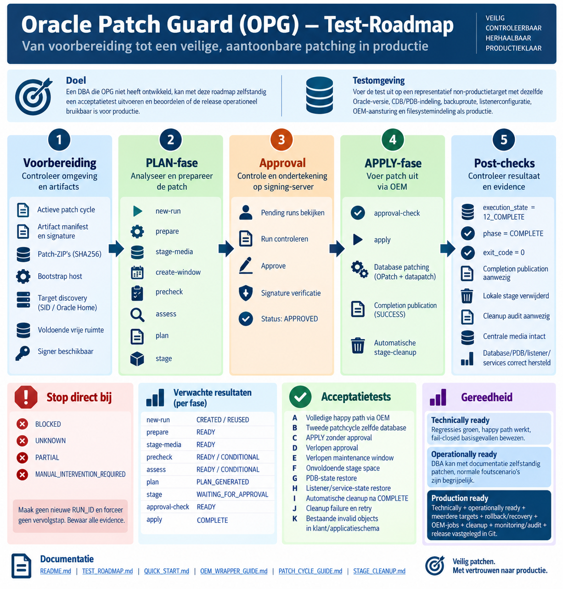

# Oracle Patch Guard — praktische test-roadmap

<p align="center">
  
</p>

Deze roadmap helpt een DBA die Oracle Patch Guard (OPG) niet heeft ontwikkeld
om zelfstandig te beoordelen of de huidige release operationeel bruikbaar is
voor productie. Voer de acceptatietest eerst uit op een representatief
non-productietarget met dezelfde Oracle-versie, CDB/PDB-indeling, backuproute,
listenerconfiguratie, OEM-aansturing en filesystemindeling als productie.

Deze roadmap vervangt geen change-, backup-, recovery- of securityprocedure.
Bij een onduidelijke uitkomst, ontbrekende evidence of afwijkende status geldt:
**stoppen, evidence bewaren en niet improviseren**.

## 1. Doel en uitgangspunten

- De tester hoeft OPG niet gebouwd of ontwikkeld te hebben.
- De test wordt uitgevoerd met de actuele documentatie en dezelfde OEM-jobs
  die later voor productie worden gebruikt.
- De focus ligt op normaal patchbeheer, fail-closed gedrag, begrijpelijke
  foutafhandeling en herstelbaarheid.
- `READY` staat vervolg toe; `CONDITIONAL` vereist bewuste beoordeling en later
  expliciete acceptatie in de approval.
- `BLOCKED`, `UNKNOWN`, `PARTIAL` en `MANUAL_INTERVENTION_REQUIRED` betekenen
  **STOP**. Maak niet blind een nieuwe RUN_ID en forceer geen vervolgstap.
- Bewaar per test de volledige OEM-output, RUN_ID, run-directory, signeroutput
  en relevante screenshots of change-records.

Gebruik in de voorbeelden de lokaal geldende, beveiligde paden. De generieke
voorbeelden hieronder gaan uit van:

```bash
OPG_ROOT=/mnt/patch-share/oracle-patch-guard
OPG_OEM="$OPG_ROOT/oem-tasks/opg_oem.sh"
```

## 2. Voorbereiding

Voer deze controles uit vóór de formele run. Visuele inspectie van een
signature is niet voldoende: `stage-media` moet de artifactsignature, ZIP
SHA256 en lokale media technisch verifiëren.

| Controle | COMMAND | EXPECTED RESULT | STOP IF |
|---|---|---|---|
| Actieve cycle | `cat "$OPG_ROOT/config/active_cycle"` | Exact de change-cycle, bijvoorbeeld `APR2026` | Bestand ontbreekt, bevat meerdere regels of wijst naar de verkeerde cycle |
| Cyclemetadata | `sed -n '1,200p' "$PATCH_ROOT/<cycle>/opg_cycle.conf"` | Juiste cycle, DB RU, OJVM, ZIP-namen, OPatch-versie en SHA256's | Waarde is leeg, onverwacht of wijkt af van de goedgekeurde change |
| Artifactmanifest | `stat "$PATCH_ROOT/<cycle>/artifact_manifest.json" "$PATCH_ROOT/<cycle>/artifact_manifest.sig"` | Beide reguliere bestanden zijn aanwezig onder de bedoelde cycle | Bestand ontbreekt, is een symlink of is ongewenst schrijfbaar |
| Patch-ZIP's | `sha256sum <DB-RU.zip> <OJVM.zip> <OPatch.zip>` | Iedere hash is exact gelijk aan `opg_cycle.conf` en `artifact_manifest.json` | Hash, bestandsnaam of patch-ID wijkt af |
| Bootstrap | `/bin/bash "$OPG_ROOT/oem-tasks/opg_bootstrap_host.sh"` | `OPG_BOOTSTRAP_RESULT|status=READY|exit_code=0` | Status is niet READY, exitcode is niet 0 of slechts een deel is geïnstalleerd |
| Target discovery | `/bin/bash "$OPG_OEM" new-run`, daarna `/bin/bash "$OPG_OEM" show-context` | Context toont exact de bedoelde host, SID, Oracle Home en cycle | Geen of meerdere targets worden gevonden, of context wijkt af |
| Vrije ruimte | `df -Pm /u01/stage "$ORACLE_HOME"` | Waarden voldoen aan de beveiligde OPG-configuratie | Alleen de afgeronde `df -h`-waarde lijkt voldoende of PRECHECK blokkeert capaciteit |
| Signer beschikbaar | Op de signer: `/secure/oracle-patch-guard/bin/opg_list_pending.sh --list` | Een leesbaar overzicht, eventueel nog zonder pending run | Configuratie-, key-, signature- of filesystemvalidatie geeft UNKNOWN/fout |

Controleer bij `show-context` ook dat
`/var/lib/oracle-patch-guard/current_run.json` de nieuwe of hergebruikte formele
RUN_ID bevat. `new-run` geeft normaal:

- `CREATED` wanneer nog geen context bestaat;
- `REUSED` bij exact hetzelfde target en dezelfde cycle;
- `ROTATED` wanneer een terminale run van een andere cycle veilig wordt
  gearchiveerd en vervangen.

Een niet-terminale conflicterende context moet fail-closed blokkeren.

## 3. Normale OEM PLAN-flow

Gebruik voor een volledige acceptatierun deze volgorde. `create-window` staat
vóór de volledige PRECHECK, zodat ook de maintenance-window-readiness geldig
kan worden beoordeeld.

```bash
/bin/bash "$OPG_ROOT/oem-tasks/opg_bootstrap_host.sh"
/bin/bash "$OPG_OEM" new-run
/bin/bash "$OPG_OEM" prepare
/bin/bash "$OPG_OEM" stage-media
/bin/bash "$OPG_OEM" create-window
/bin/bash "$OPG_OEM" precheck
/bin/bash "$OPG_OEM" assess
/bin/bash "$OPG_OEM" plan
/bin/bash "$OPG_OEM" stage
```

| Stap | Verwachte operationele uitkomst | STOP IF |
|---|---|---|
| `opg_bootstrap_host.sh` | `READY`, exitcode 0 | Iedere andere status of exitcode |
| `new-run` | `CREATED` of `REUSED`; bij een bewezen terminale vorige cycle: `ROTATED` | Conflicterende niet-terminale context, verkeerde targetbinding of UNKNOWN |
| `prepare` | `READY`, exitcode 0 | Niet READY of gedeeltelijke hostvoorbereiding |
| `stage-media` | `READY`, exitcode 0 | Signature-, ZIP-, versie-, hash-, ruimte- of stagevalidatie faalt |
| `create-window` | Geldig venster voor exact dezelfde formele RUN_ID | Window ontbreekt, is te kort, verlopen of verkeerd gebonden |
| `precheck` | `READY` of beoordeelde `CONDITIONAL` | `BLOCKED` of `UNKNOWN`; bij een CONDITIONAL zonder geaccepteerde operationele onderbouwing |
| `assess` | `READY` of beoordeelde `CONDITIONAL` | `BLOCKED` of `UNKNOWN` |
| `plan` | `PLAN_GENERATED`, exitcode 0 | Manifest/state ontbreekt, wijkt af of PLAN blokkeert |
| `stage` | `status=STAGED`, `next=WAITING_FOR_APPROVAL` | Approval-artifacts zijn incompleet, onveilig of niet exact aan de RUN_ID gebonden |

Een vroege PRECHECK direct na `stage-media` is toegestaan als tussentijdse
readinesscontrole. Zonder een bruikbaar maintenance window kan die nog
`WINDOW_INVALID` rapporteren. Voor de formele acceptatie-uitkomst wordt
PRECHECK daarom opnieuw uitgevoerd na `create-window`.

Controleer na `stage` dat de signer exact dezelfde RUN_ID als `PENDING` ziet.
Ga niet door op basis van alleen een geslaagde shell-exitcode; controleer ook de
machine-readable resultaatregel en de gegenereerde evidence.

## 4. Approval op de signing-server

1. Toon alle kandidaat-runs:

   ```bash
   /secure/oracle-patch-guard/bin/opg_list_pending.sh --list
   ```

2. Controleer voor de geselecteerde RUN_ID minimaal host, SID, cycle,
   Oracle Home, manifesthash en alle findings.
3. Beoordeel iedere `CONDITIONAL` inhoudelijk. Alleen bewust geaccepteerde
   conditionals mogen in de approval worden opgenomen.
4. Laat de single-run signer de approval maken:

   ```bash
   /secure/oracle-patch-guard/bin/opg_approve_run.sh <RUN_ID>
   ```

   Voer de vereiste bevestiging `APPROVE` alleen in wanneer alle bindings
   kloppen.
5. Controleer opnieuw:

   ```bash
   /secure/oracle-patch-guard/bin/opg_list_pending.sh --list
   ```

De acceptatie slaagt alleen wanneer:

- de manifest signature `VERIFIED` is;
- de approval signature `VERIFIED` is;
- manifest-, host-, Oracle-Home-, fingerprint- en conditionalsbinding kloppen;
- de status voor exact dezelfde RUN_ID `APPROVED` is.

Een ongeldige signature, ontbrekende binding, onverwachte RUN_ID of verlopen
approval is `UNKNOWN`/`BLOCKED`: **STOP**.

## 5. OEM APPLY-flow

Voer op het target eerst de afzonderlijke read-only approvalcontrole uit:

```bash
/bin/bash "$OPG_OEM" approval-check
```

Verwacht een resultaat met `status=READY`, `phase=DRY_RUN` en `exit_code=0`.
Deze controle veroorzaakt geen downtime en vervangt de controles binnen APPLY
niet.

Voer daarna APPLY uit:

```bash
/bin/bash "$OPG_OEM" apply
```

Een succesvolle happy path eindigt in deze volgorde:

1. APPLY en technische VALIDATE slagen;
2. execution state wordt `12_COMPLETE` / `COMPLETE` / `exit_code=0`;
3. completion publication rapporteert `SUCCESS`;
4. de gebonden lokale execution-stage wordt automatisch opgeschoond;
5. het stage-cleanup-auditrecord bevat `cleanup_status=PURGED`; een geldige
   idempotente herhaling mag in de commandoutput `ALREADY_PURGED` rapporteren.

De losse actie `publish-completion` is **geen normale happy-path-stap**. Zij is
alleen bedoeld voor recovery/republication wanneer de patch al `12_COMPLETE`
is maar completion-publicatie eerder niet slaagde.

Als cleanup faalt, blijft de patchstatus `COMPLETE` en wordt
`cleanup=FAILED_RETAINED` gerapporteerd. Behandel dat als operationele
follow-up; draai APPLY niet opnieuw.

## 6. Post-checks

Vervang `<RUN_ID>`, `<cycle>` en `<identity>` door de vastgelegde waarden.

| Controle | COMMAND / evidence | Verwacht |
|---|---|---|
| Terminale state | `python3 -m json.tool /var/log/oracle-patch-guard/<RUN_ID>/execution_state.json` | `state=12_COMPLETE`, `phase=COMPLETE`, `exit_code=0` |
| Completion-publicatie | `python3 -m json.tool "$APPROVAL_ROOT/<RUN_ID>/completion.json"` | Geldige completion voor dezelfde RUN_ID, manifest- en approvalhash |
| Lokale stage | `test ! -e /u01/stage/oracle-patch-guard/ready/<cycle>/<identity>` | De gebonden execution-stage bestaat niet meer |
| Cleanup-audit | `python3 -m json.tool /var/lib/oracle-patch-guard/stage-cleanup/<RUN_ID>.json` | `cleanup_status` is `PURGED`; een retry mag daarnaast `ALREADY_PURGED` rapporteren |
| Centrale media | `stat <centrale DB-RU.zip> <centrale OJVM.zip> <centrale OPatch.zip>` | Alle centrale media en artifactmanifesten bestaan ongewijzigd |
| Run-evidence | `find /var/log/oracle-patch-guard/<RUN_ID> -maxdepth 1 -type f -print` | Logs, state, manifests, recovery- en validatie-evidence zijn behouden |
| Database/PDB | Controleer `database_state_before.csv`, `database_state_after.csv` en verse SQL-query's | Database-role/open mode en oorspronkelijke PDB-states zijn hersteld |
| Listener/services | Vergelijk listener/service-evidence vóór en na APPLY; voer zo nodig `"$ORACLE_HOME/bin/lsnrctl" status` uit | Alleen oorspronkelijk actieve listener/services zijn correct hersteld en READY waar vereist |

Controleer expliciet dat cleanup nooit deze gegevens heeft verwijderd:

- `$ORACLE_HOME/.patch_storage`;
- `/var/log/oracle-patch-guard/<RUN_ID>`;
- approvals, signatures en `completion.json`;
- recovery-/rollbackevidence;
- centrale ZIPs, cyclemetadata en artifactmanifesten.

## 7. Praktijkgerichte acceptatietests

Voer muterende scenario's uitsluitend uit op een change-goedgekeurd
non-productietarget. Bewaar per scenario de registratie uit hoofdstuk 10.

### A. Volledige happy path via OEM

- [ ] Doorloop bootstrap, PLAN-flow, approval-check en APPLY uitsluitend via de
  gedocumenteerde OEM-jobs.
- [ ] Controleer dat geen losse handmatige patch-, signing- of filesystemstap
  nodig was.
- [ ] **PASS:** `12_COMPLETE`, geldige completion-publicatie, correcte runtime-
  restore en cleanup-audit `PURGED`.

### B. Tweede patchcycle op dezelfde database

- [ ] Rond cycle 1 volledig af en activeer daarna een andere geldige cycle.
- [ ] Voer `new-run` uit en verwacht `ROTATED` met een automatische of expliciete
  auditreden.
- [ ] Voer `new-run` voor dezelfde nieuwe context nogmaals uit en verwacht
  `REUSED` met byte-identieke actieve context.
- [ ] Controleer dat archive/history en evidence van de vorige COMPLETE-run
  behouden zijn.
- [ ] **STOP:** rotatie vanuit een niet-terminale context wordt toegestaan of
  `current_run.json` wordt blind verwijderd.

### C. APPLY zonder approval

- [ ] Maak op non-productie een PLAN, maar publiceer geen approval.
- [ ] Start `approval-check` of `apply`.
- [ ] **PASS:** `BLOCKED` vóór shutdown, OPatch-upgrade, RU/OJVM of datapatch;
  database en listener blijven in hun oorspronkelijke toestand.

### D. Verlopen approval

- [ ] Gebruik een testapproval waarvan de geldigheidsduur aantoonbaar is
  verstreken; wijzig geen gesigneerd artifact.
- [ ] Start `approval-check` en daarna geen verdere stap wanneer deze blokkeert.
- [ ] **PASS:** verlopen approval wordt vóór iedere mutatie `BLOCKED`/ongeldig.

### E. Verlopen maintenance window

- [ ] Laat een change-goedgekeurd testvenster verlopen zonder manifest of
  timestamps handmatig te wijzigen.
- [ ] Voer PRECHECK of APPLY-hercontrole uit.
- [ ] **PASS:** `WINDOW_INVALID`/`BLOCKED` vóór downtime.

### F. Onvoldoende stage space

- [ ] Gebruik een gecontroleerd non-productiescenario waarin de geconfigureerde
  minimumruimte niet beschikbaar is.
- [ ] **PASS:** PRECHECK rapporteert capaciteit/stage-space `BLOCKED`.
- [ ] Herstel ruimte via de normale retentie-/cleanup-procedure; verwijder nooit
  een stage van een actieve of onduidelijke run.
- [ ] Voer PRECHECK opnieuw uit en verwacht een actuele READY/CONDITIONAL-
  beoordeling.

### G. PDB-state restore

- [ ] Leg vooraf een representatieve combinatie van OPEN READ WRITE, READ ONLY
  en/of MOUNTED user-PDB's vast.
- [ ] Doorloop de patchrun.
- [ ] **PASS:** OPG opent waar nodig tijdelijk voor datapatch en herstelt daarna
  iedere oorspronkelijke user-PDB-state; `PDB$SEED` is geen user-PDB-testobject.

### H. Listener/service-state restore

- [ ] Leg vooraf vast welke listeners en services actief en gestopt zijn.
- [ ] **PASS:** oorspronkelijk actieve onderdelen zijn na APPLY gezond; vooraf
  gestopte listeners/services worden niet ongewenst gestart.
- [ ] **STOP:** een proces komt uit een andere Oracle Home, een vereiste service
  is niet READY of de oorspronkelijke state wijkt af.

### I. Automatische cleanup na COMPLETE

- [ ] Controleer `12_COMPLETE` en completion-publicatie `SUCCESS`.
- [ ] **PASS:** alleen de gebonden lokale stage is verwijderd, de cleanup-audit
  is `PURGED` en alle centrale media en run-evidence zijn behouden.

### J. Cleanup failure en retry

- [ ] Voer dit alleen uit in een disposable non-productieomgeving met een
  vooraf goedgekeurde, reversibele fault-injection. Wijzig of vervang geen
  privileged helper en verzwak geen sudoers- of filesystembeveiliging.
- [ ] **PASS bij initiële fout:** patch blijft `COMPLETE`, publicatie blijft
  `PUBLISHED`, cleanup wordt `FAILED_RETAINED` en de stage wordt niet onveilig
  verwijderd.
- [ ] Herstel uitsluitend de cleanupoorzaak en voer uit:

  ```bash
  /bin/bash "$OPG_OEM" cleanup-stage --run-id <RUN_ID>
  ```

- [ ] **PASS bij retry:** `PURGED` of `ALREADY_PURGED`; herhalen blijft veilig en
  idempotent.

### K. Bestaande invalid objects in klant-/applicatieschema

- [ ] Gebruik een reeds bekende invalid of een change-goedgekeurd object in een
  speciaal non-productietestschema; wijzig geen Oracle-maintained object voor
  deze test.
- [ ] **PASS:** vooraf bestaande invalid objects worden zichtbaar geregistreerd
  als `PREEXISTING_INVALIDS`/`CONDITIONAL` en vereisen bewuste acceptatie, maar
  zijn geen automatische harde patchblocker.
- [ ] Controleer dat het aantal invalid objects na APPLY niet is toegenomen.
- [ ] Een niet-VALID Oracle-component, SQLPATCH-fout, nieuwe invalids of andere
  kritieke eindvalidatiefout blijft blokkerend of leidt tot handmatige
  interventie volgens de bestaande severitylogica.

## 8. Wat eerdere testcycli al hebben bewezen

De eerdere Oracle Linux/non-productietests hebben reeds bewijs opgeleverd voor:

- artifactmanifest signing en signaturevalidatie;
- JUL2026 `stage-media` met lokale immutable media;
- `CONDITIONAL` PRECHECK en assessment;
- manifestgebonden approval signing;
- terminale state `12_COMPLETE`;
- hashgebonden completion-publicatie;
- `new-run` voor een tweede cycle en het idempotente `REUSED`-gedrag;
- fail-closed blokkade bij onvoldoende stage-space;
- automatische lokale stage-cleanup;
- veilige/idempotente cleanup-retry na `FAILED_RETAINED`;
- uitvoering van de privileged Python-runtime op Python 3.6.8.

Dit historische bewijs voorkomt onnodige herhaling van technische
randfouttests, maar vervangt **geen** representatieve end-to-end acceptatierun
door de beoogde DBA/operator op de beoogde targetklasse.

## 9. Go/No-Go-criteria

### TECHNICALLY READY

- alle regressies van de exacte release zijn groen;
- de representatieve happy path werkt;
- approval-, window-, space- en mediafouten blokkeren vóór mutatie;
- terminale state, completion-publicatie en cleanup-evidence zijn coherent.

### OPERATIONALLY READY

- aan alle criteria voor TECHNICALLY READY is voldaan;
- een DBA die OPG niet heeft ontwikkeld kan de flow zelfstandig met deze
  roadmap, de documentatie en OEM-jobs uitvoeren;
- normale afwijkingen zijn begrijpelijk en leiden tot de juiste stop- of
  herstelactie;
- de operator heeft geen codekennis of ad-hoc filesystemingrepen nodig.

### PRODUCTION READY

- aan alle criteria voor TECHNICALLY READY en OPERATIONALLY READY is voldaan;
- meerdere representatieve targets/cycles zijn getest;
- Oracle Home- en database-recovery/rollback zijn praktisch bewezen;
- de echte OEM PLAN- en APPLY-jobs zijn bewezen;
- automatische cleanup is bewezen zonder verlies van audit/recovery-evidence;
- monitoring, logging, audittrail, approvals en bewaartermijnen zijn beoordeeld;
- de exacte gevalideerde release en configuratie zijn immutable in Git en in
  de deployment vastgelegd.

Bij één niet-afgesloten `FAIL` of veiligheidsrelevante `FOLLOW-UP REQUIRED` is
de uitkomst **NO-GO** voor productie.

## 10. Testregistratie

Gebruik per scenario minimaal deze tabel:

| Datum | Tester | Host | SID | Cycle | Scenario | Resultaat | RUN_ID | Opmerking |
|---|---|---|---|---|---|---|---|---|
| YYYY-MM-DD | naam | host | SID | cycle | A–K / omschrijving | PASS / ... | RUN_ID | evidencepad/change |

Eindbeoordeling:

- [ ] `PASS` — alle verwachte resultaten zijn aantoonbaar behaald.
- [ ] `PASS WITH CONDITIONS` — alleen expliciet beoordeelde, niet-blokkerende
  voorwaarden blijven open.
- [ ] `FAIL` — gedrag wijkt af of een veiligheidscontrole faalt.
- [ ] `FOLLOW-UP REQUIRED` — bewijs of operationele besluitvorming ontbreekt.

Leg naast de tabel vast:

- Git commit/release en SHA256 van het gedeployde release-archief;
- relevante centrale en lokale configuratieversies;
- begin- en eindtijd;
- OEM-joboutput en proces-exitcodes;
- signerstatus vóór en na approval;
- paden naar run-, completion- en cleanup-evidence;
- eventuele conditionals en wie deze heeft geaccepteerd.

## 11. Documentatie

- [README.md](README.md) — actuele introductie, scope en stable baseline;
- [QUICK_START.md](QUICK_START.md) — compacte operationele flow;
- [OEM_WRAPPER_GUIDE.md](OEM_WRAPPER_GUIDE.md) — wrapper, discovery, context en
  OEM-aanroepen;
- [PATCH_CYCLE_GUIDE.md](PATCH_CYCLE_GUIDE.md) — nieuwe cycle maken,
  ondertekenen en activeren;
- [STAGE_CLEANUP.md](STAGE_CLEANUP.md) — automatische cleanup, statussen en
  veilige retry.
